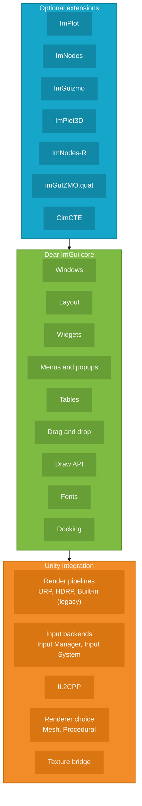

# UImGui

<p align="center">
  <a href="https://github.com/psydack/uimgui/blob/main/package.json">
    
  </a>
  <a href="https://openupm.com/packages/com.psydack.uimgui/">
    
  </a>
  <a href="https://unity.com/releases/editor/qa/lts-releases">
    
  </a>
  <a href="LICENSE">
    
  </a>
</p>

<p align="center">
  <strong>Dear ImGui for Unity</strong><br>
  Built on <a href="https://github.com/mellinoe/ImGui.NET">ImGui.NET</a>, ready for <strong>URP</strong>, <strong>HDRP</strong>, <strong>Built-in</strong>, <strong>IL2CPP</strong>, <strong>docking</strong>, <strong>FreeType</strong>, and opt-in integrations like <strong>ImPlot</strong>, <strong>ImNodes</strong>, and <strong>ImGuizmo</strong>.
</p>

<p align="center">
  <a href="https://github.com/psydack/uimgui">Repository</a>
  ·
  <a href="https://openupm.com/packages/com.psydack.uimgui/">OpenUPM</a>
  ·
  <a href="https://github.com/psydack/uimgui/issues">Issues</a>
  ·
  <a href="https://github.com/psydack/uimgui/blob/main/CHANGELOG.md">Changelog</a>
</p>

---

## Why UImGui

**UImGui** is a Unity-focused Dear ImGui integration packaged for a practical workflow:

- install with **UPM** or **OpenUPM**
- use **ImGui.NET** as the managed API layer
- support **Built-in**, **URP**, and **HDRP**
- support both **Unity Input Manager** and **Unity Input System**
- work with **IL2CPP**
- expose **textures/images**, **docking**, **font customization**, and **optional Dear ImGui ecosystem integrations**

It is a strong fit for:

- debug UI
- internal tools
- runtime overlays
- editor-like workflows
- plotting and visualization
- gizmos and transform tools
- node editors

---

## Table of contents

- [Installation](#installation)
- [Quick start](#quick-start)
- [Render pipeline setup](#render-pipeline-setup)
- [Feature snapshot](#feature-snapshot)
- [Optional integrations](#optional-integrations)
- [Dear ImGui coverage](#dear-imgui-coverage)
- [Fonts and FreeType](#fonts-and-freetype)
- [Textures and images](#textures-and-images)
- [IL2CPP notes](#il2cpp-notes)
- [Samples](#samples)
- [Troubleshooting](#troubleshooting)
- [Credits](#credits)
- [License](#license)

---

## Installation

### Install from Git URL

Default install path, always tracking the repository default branch:

```json
{
  "dependencies": {
    "com.psydack.uimgui": "https://github.com/psydack/uimgui.git"
  }
}
```

You can also use:

**Unity Package Manager > Add package from Git URL**

and paste:

```text
https://github.com/psydack/uimgui.git
```

### Install from OpenUPM

Package page:

```text
https://openupm.com/packages/com.psydack.uimgui/
```

CLI:

```bash
openupm add com.psydack.uimgui
```

---

## Quick start

### 1. Add `UImGui` to a scene

Create or select a GameObject and add the **UImGui** component.

Assign:

- a **Camera**
- a **RenderImGui** feature if you are using **URP**
- the desired **Platform Type**, `Input Manager` or `Input System`

### 2. Subscribe to the layout event

Use the global event if you want a shared entry point.
Use an instance event if you want a specific `UImGui` context.

### Global example

```csharp
using ImGuiNET;
using UImGui;
using UnityEngine;

public class ImGuiGlobalSample : MonoBehaviour
{
    private void OnEnable()
    {
        UImGuiUtility.Layout += OnLayout;
    }

    private void OnDisable()
    {
        UImGuiUtility.Layout -= OnLayout;
    }

    private void OnLayout(UImGui.UImGui ui)
    {
        ImGui.Begin("Hello UImGui");
        ImGui.Text("Dear ImGui is running inside Unity.");
        ImGui.End();
    }
}
```

### Instance example

```csharp
using ImGuiNET;
using UImGui;
using UnityEngine;

public class ImGuiInstanceSample : MonoBehaviour
{
    [SerializeField] private UImGui.UImGui ui;

    private void OnEnable()
    {
        if (ui != null)
            ui.Layout += OnLayout;
    }

    private void OnDisable()
    {
        if (ui != null)
            ui.Layout -= OnLayout;
    }

    private void OnLayout(UImGui.UImGui current)
    {
        ImGui.Begin("Instance Layout");
        ImGui.Text("This window belongs to a specific UImGui instance.");
        ImGui.End();
    }
}
```

---

## Render pipeline setup

### Built-in Render Pipeline

No special setup is required.

> Built-in is still supported by the package. In modern Unity documentation it is better treated as a legacy pipeline, not as a removed one.

### URP

1. Run **Tools > UImGui > Add Render Feature to URP**.
2. Assign the generated `RenderImGui` asset to the **Render Feature** field on the `UImGui` component.
3. If you add a new renderer later, run the menu again or add the feature manually.

### HDRP

1. Add a Volume > **Custom Pass** to the scene.
2. Add **DearImGuiPass** in the custom passes.
3. Set the injection point before or after post processing.

---

## Feature snapshot

### Unity integration

| Capability | Status | Notes |
| --- | --- | --- |
| UPM package | ✅ | Package name: `com.psydack.uimgui` |
| OpenUPM package | ✅ | Public package page available |
| Unity baseline | ✅ | `2022.3` |
| ImGui.NET integration | ✅ | Main managed API bridge |
| Built-in Render Pipeline | ✅ | Supported, legacy Unity pipeline |
| URP | ✅ | Requires `RenderImGui` feature |
| HDRP | ✅ | Uses custom pass integration |
| Unity Input Manager | ✅ | Supported |
| Unity Input System | ✅ | Supported |
| IL2CPP | ✅ | Supported |
| Textures and images | ✅ | Texture ID bridge available |
| Docking | ✅ | Supported |
| FreeType | ✅ | Default font loading path |
| Mesh renderer | ✅ | Safest default |
| Procedural renderer | ✅ | Better for heavier desktop-class workloads |
| Multi-viewports | ❌ | Not supported by the current Unity integration |

### Platforms

| Platform | Status |
| --- | --- |
| Windows x64 | ✅ |
| Windows x86 | ✅ |
| Windows arm64 | ✅ |
| Linux | ✅ |
| macOS | ✅ |

### Renderer choices

| Renderer | Best for | Notes |
| --- | --- | --- |
| **Mesh** | Most projects | Default, broadest compatibility |
| **Procedural** | Desktop and console-style targets | Uses GPU buffers and indirect draws, not intended for WebGL |

If you are unsure, use **Mesh**.

---

## Optional integrations

UImGui includes several optional integrations. They are **disabled by default** and should be enabled only when your project needs them.

Useful upstream references:

- cimgui ecosystem: <https://github.com/orgs/cimgui/repositories>
- Dear ImGui upstream: <https://github.com/ocornut/imgui>

### Optional feature matrix

| Define symbol | Integration | Purpose | Status |
| --- | --- | --- | --- |
| `UIMGUI_ENABLE_IMPLOT` | [ImPlot](https://github.com/epezent/implot) | 2D plots and charts | ✅ |
| `UIMGUI_ENABLE_IMNODES` | [ImNodes](https://github.com/Nelarius/imnodes) | Node editor UI | ✅ |
| `UIMGUI_ENABLE_IMGUIZMO` | [ImGuizmo](https://github.com/CedricGuillemet/ImGuizmo) | Transform gizmos | ✅ |
| `UIMGUI_ENABLE_IMPLOT3D` | [ImPlot3D](https://github.com/brenocq/implot3d) | 3D plotting | ✅ |
| `UIMGUI_ENABLE_IMNODES_R` | [ImNodes-R](https://github.com/rokups/imgui-nodes) | Alternative node editor wrapper | ✅ |
| `UIMGUI_ENABLE_IMGUIZMO_QUAT` | [imGuIZMO.quat](https://github.com/BrutPitt/imGuIZMO.quat) | Quaternion gizmo | ✅ |
| `UIMGUI_ENABLE_CIMCTE` | [CimCTE](https://github.com/nicktarnold/CimCTE) | Code text editor | ✅ |

### How to enable them

Add the corresponding symbols to:

**Project Settings > Player > Other Settings > Script Define Symbols**

The `ShowDemoWindow` sample is a good place to verify enabled integrations in practice.

---

## Dear ImGui coverage

This section focuses on the practical Dear ImGui surface available through the package, separate from Unity-specific integration details.

### Supported feature families

| Feature family | Status | Notes |
| --- | --- | --- |
| Core context and frame lifecycle | ✅ | Context, IO, style, frame lifecycle |
| Windows and layout | ✅ | Windows, child windows, sizing, focus, scrolling |
| Core widgets | ✅ | Buttons, sliders, inputs, combos, trees, colors, images |
| Menus, popups, tooltips | ✅ | Menu bars, menus, popups, modal popups, tooltips |
| Tabs | ✅ | Tab bars and tab items |
| Tables | ✅ | Dear ImGui tables API |
| Drag and drop | ✅ | Sources, targets, payloads |
| Draw API | ✅ | `ImDrawList`, callbacks, custom primitives |
| Fonts and text rendering | ✅ | Font atlas, TTF/OTF loading, glyph ranges |
| Textures | ✅ | Texture-backed widgets |
| Docking | ✅ | Dock spaces and docked windows |
| Multi-select | ✅ | Public docking-branch multi-select API family |
| Multi-viewports | ❌ | Exposed upstream, not supported by this Unity integration |

### Practical reading of upstream markers

The Dear ImGui docking branch publicly exposes markers such as:

- `IMGUI_HAS_TABLE`
- `IMGUI_HAS_TEXTURES`
- `IMGUI_HAS_VIEWPORT`
- `IMGUI_HAS_DOCK`

For UImGui users, the practical interpretation is simple:

- **Docking is supported**
- **Multi-viewports are not supported in the current Unity integration**

---

## Layered mental model

The easiest way to evaluate UImGui is as a layered package:

- **Unity integration** at the base, responsible for engine-specific rendering and platform concerns.
- **Dear ImGui core** in the middle, providing the immediate-mode UI model and main runtime features.
- **Optional extensions** on top, enabled only when your project needs them.



---

## Fonts and FreeType

UImGui uses **FreeType** as the default font loading path.

> Font atlas status: **WIP**.  
> The workflow is usable, but still under stabilization and sample hardening.

### Option A — FontAtlasConfigAsset (recommended)

Create a `FontAtlasConfigAsset` via **Assets → Create → Dear ImGui → Font Atlas Configuration**, add font entries, and assign it to the `UImGui` component's **Font Atlas Configuration** field.

Font paths in the asset are **relative to `Application.streamingAssetsPath`**. Copy your `.ttf` / `.otf` files to `Assets/StreamingAssets/` in your project.

**Quick start with the bundled sample font:**

1. Copy `NewClear-mincho.ttf` from the package `Resources/` folder to your project's `Assets/StreamingAssets/`.
2. Assign the `Sample/FontAtlasNewClearMincho` asset (included in the package) to the **Font Atlas Configuration** field on your `UImGui` component.
3. Enter Play mode — the font atlas is built automatically with Default + Japanese glyph ranges.

### Option B — Custom initializer callback

Wire a method to the **Font Custom Initializer** field on the `UImGui` component:

```csharp
using ImGuiNET;
using UnityEngine;

public static class MyFonts
{
    public static unsafe void AddFonts(ImGuiIOPtr io)
    {
        io.Fonts.AddFontDefault();
        // Path must be absolute or use Application.streamingAssetsPath at runtime.
        string path = System.IO.Path.Combine(Application.streamingAssetsPath, "NewClear-mincho.ttf");
        io.Fonts.AddFontFromFileTTF(path, 18.0f);
    }
}
```

Recommended approach:

- keep font loading centralized in one initializer
- build the atlas at initialization time, not during layout
- avoid ad hoc runtime font mutations unless you understand the lifecycle implications
- use `NewClear-mincho.ttf` as the reference sample font in this repository

---

## Frame lifecycle

Understanding where ImGui work happens is important when debugging or integrating with URP.

```
Unity Update()
  └─ UImGui.DoUpdate()
       ├─ ImGui.NewFrame()
       ├─ fires Layout event  ← your OnLayout callbacks go here
       └─ ImGui.Render()      ← draw data is finalized

URP RecordRenderGraph()
  └─ RenderImGui render feature
       └─ RenderDrawData()    ← GPU commands issued from finalized draw data
```

Key rules:

- **Submit all ImGui calls inside the `Layout` event.** Do not call ImGui widgets in `Update`, `LateUpdate`, or coroutines.
- **Do not mutate ImGui state after `Layout` fires and before the next frame's `NewFrame`.** The draw data is already finalized at that point.
- The two-phase split (`DoUpdate` → `RenderDrawData`) is required by URP 17+ Render Graph. Built-in and HDRP use a similar separation.

---

## Textures and images

To render a Unity texture in Dear ImGui, request a texture ID from the utility bridge:

```csharp
using ImGuiNET;
using UnityEngine;

public class ImGuiTextureSample : MonoBehaviour
{
    [SerializeField] private Texture texture;

    private void OnEnable()
    {
        UImGui.UImGuiUtility.Layout += OnLayout;
    }

    private void OnDisable()
    {
        UImGui.UImGuiUtility.Layout -= OnLayout;
    }

    private void OnLayout(UImGui.UImGui ui)
    {
        if (texture == null)
            return;

        ImGui.Begin("Texture Sample");
        var id = UImGui.UImGuiUtility.GetTextureId(texture);
        ImGui.Image(id, new System.Numerics.Vector2(texture.width, texture.height));
        ImGui.End();
    }
}
```

---

## IL2CPP notes

- `allowUnsafeCode = true` is already enabled in the package assembly definition.
- If required assemblies are stripped, add a `link.xml`.
- Start with **Managed Stripping Level: Minimal** and tighten only after the build is verified.

Example:

```xml
<linker>
  <assembly fullname="ImGuiNET" preserve="all"/>
  <assembly fullname="ImPlotNET" preserve="all"/>
  <assembly fullname="imnodesNET" preserve="all"/>
</linker>
```

---

## Vector conversions

`UImGui.VectorExtensions` provides bridge helpers between `UnityEngine` vectors and `System.Numerics` vectors.

```csharp
using ImGuiNET;
using UImGui;
using UnityEngine;

public class VectorBridgeSample : MonoBehaviour
{
    private void Example(Vector2 position)
    {
        ImGui.SetNextWindowPos(position.AsNumerics());
    }
}
```

---

## Samples

The package includes a sample entry point under `Sample/`.

Useful starting points:

- **Demo Window** sample
- `ShowDemoWindow.cs`
- optional integrations toggled through define symbols

---

## Troubleshooting

### Locked DLL on Windows — Editor crashes or fails to reload

On Windows, Unity keeps native DLLs locked while the Editor is open.  
**Always close the Unity Editor before copying or replacing `cimgui.dll` or any other native plugin.**  
Replacing a locked DLL without closing the Editor leaves a partially overwritten file that causes load failures or crashes on next open.

### Font atlas is empty or shows only boxes

`FontAtlasConfigAsset` is **optional**. The default Dear ImGui font renders without it.  
If you assigned a custom font atlas config and see no glyphs:

1. Confirm the `.ttf` / `.otf` file exists in `Assets/StreamingAssets/` at the path listed in the asset.
2. The path in the asset is **relative to `Application.streamingAssetsPath`** — do not include the full `Assets/StreamingAssets/` prefix.
3. Re-enter Play mode after copying the font file.

### `EntryPointNotFoundException: igGetIO_Nil`

The native `cimgui.dll` is usually not loading correctly.

Check:

- stale `.meta` constraints on the native plugin
- a locked DLL after a failed update
- platform import settings for the native libraries

### `Multiple precompiled assemblies with the same name System.Runtime.CompilerServices.Unsafe.dll`

Another package already includes the same DLL.

Add this define symbol:

- `UIMGUI_REMOVE_UNSAFE_DLL`

Then restart the Unity Editor.

### URP renders nothing

Most of the time the `RenderImGui` feature is missing or not assigned.

Check:

1. **Tools > UImGui > Add Render Feature to URP**
2. assign the generated asset to the `UImGui` component

### `Platform not available`

The selected input backend requires a Unity package that is not installed.

Common case:

- `Input System` selected, but `com.unity.inputsystem` is not installed

### Viewports warning or error

If viewport mode is enabled in configuration, the editor warns because Unity does not support different platform viewports in the current integration.

### Extension-specific rendering issues

If an optional integration misbehaves:

- verify its define symbol is enabled
- confirm the native binaries are present for the current platform
- check upstream issues for that specific project

---

## Motivation

The practical goal of UImGui is straightforward:

**make Dear ImGui in Unity easier to install, easier to maintain, and easier to evolve.**

---

## Credits

- Dear ImGui: <https://github.com/ocornut/imgui>
- ImGui.NET: <https://github.com/mellinoe/ImGui.NET>
- Original inspiration: <https://github.com/realgamessoftware/dear-imgui-unity>
- cimgui ecosystem: <https://github.com/orgs/cimgui/repositories>
- NewClear-mincho free font sample: <https://booth.pm/en/items/713295>

---

## License

This package is distributed under the **MIT License**.

See the repository `LICENSE` file and the upstream Dear ImGui license for the original library.
